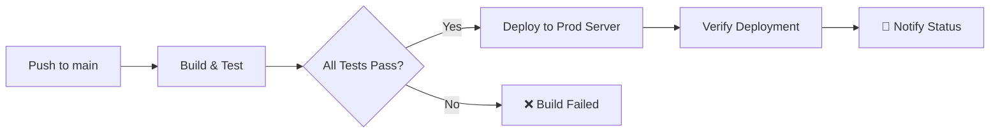

# 🔍 GMARM Monitoring & CI/CD Documentation

## 📋 Overview

Este documento describe el sistema de monitoreo y CI/CD implementado para GMARM, incluyendo GitHub Actions workflows, scripts de monitoreo local y alertas automáticas.

## 🚀 GitHub Actions Workflows

### 1. CI/CD Pipeline (`.github/workflows/deploy.yml`)

**Trigger:** Push a `dev` o `main`, Pull Requests, o ejecución manual

#### Jobs:
- **🔨 Build & Test**: Compilación y pruebas de frontend/backend
- **🚀 Deploy**: Deployment automático al servidor
- **📢 Notifications**: Resumen y alertas del pipeline

#### Características:
- ✅ Build paralelo de frontend y backend
- ✅ Tests automáticos con manejo de errores
- ✅ Deployment condicional (solo si build es exitoso)
- ✅ Verificación post-deployment
- ✅ Resúmenes detallados con GitHub Step Summary
- ✅ Entornos separados (development/production)

### 2. Monitoring Workflow (`.github/workflows/monitor.yml`)

**Trigger:** Cada 30 minutos, o ejecución manual

#### Jobs:
- **🏥 Health Check**: Verificación de servicios backend/frontend
- **⚡ Performance Check**: Monitoreo de tiempos de respuesta
- **🚨 Alert**: Creación automática de issues para problemas críticos

#### Características:
- ✅ Monitoreo continuo de ambos entornos
- ✅ Alertas automáticas por problemas críticos
- ✅ Métricas de performance
- ✅ Creación automática de issues en GitHub

## 🛠️ Scripts de Monitoreo Local

### 1. `scripts/monitor-system.sh` (Linux/macOS)

```bash
# Dar permisos de ejecución
chmod +x scripts/monitor-system.sh

# Ejecutar monitoreo
./scripts/monitor-system.sh
```

**Verifica:**
- ✅ Estado de Docker y contenedores
- ✅ Conectividad de base de datos
- ✅ Servicios HTTP (backend/frontend)
- ✅ Endpoints específicos de API
- ✅ Logs recientes
- ✅ Uso de recursos (CPU, memoria, disco)

### 2. `scripts/monitor-system.ps1` (Windows/PowerShell)

```powershell
# Ejecutar monitoreo básico
.\scripts\monitor-system.ps1

# Ejecutar con logs detallados
.\scripts\monitor-system.ps1 -Verbose
```

**Mismas verificaciones que el script de Linux, optimizado para PowerShell.**

## 📊 Métricas y Alertas

### Health Checks

| Servicio | Endpoint | Frecuencia | Timeout |
|----------|----------|------------|---------|
| Backend Dev | `http://72.167.52.14:8080/api/health` | 30 min | 30s |
| Frontend Dev | `http://72.167.52.14:5173` | 30 min | 30s |
| Backend Prod | `https://gmarm.com/api/health` | 30 min | 30s |
| Frontend Prod | `https://gmarm.com` | 30 min | 30s |

### Performance Thresholds

| Métrica | Warning | Critical |
|---------|---------|----------|
| Backend Response Time | > 3s | > 5s |
| Frontend Load Time | > 2s | > 4s |

### Alertas Automáticas

- 🚨 **Critical Health Issues**: Se crea automáticamente un issue en GitHub
- ⚠️ **Performance Issues**: Logs de warning en el workflow
- 📢 **Pipeline Failures**: Notificaciones en GitHub Step Summary

## 🔧 Configuración del Servidor

### Secrets Requeridos en GitHub

```yaml
# Secrets necesarios en GitHub Repository Settings
SSH_PRIVATE_KEY:     # Clave privada SSH para acceso al servidor
SERVER_USER:         # Usuario del servidor (ej: ubuntu)
SERVER_HOST:         # IP o hostname del servidor (ej: 72.167.52.14)
```

### Estructura de Directorios en Servidor

```
/home/{SERVER_USER}/deploy/
├── dev/                 # Ambiente de desarrollo
│   ├── gmarm/          # Código fuente
│   ├── docker-compose.dev.yml
│   └── deploy-server.sh
└── prod/               # Ambiente de producción
    ├── gmarm/          # Código fuente
    ├── docker-compose.prod.yml
    └── deploy-server.sh
```

## 🚀 Deployment Process

### 1. Desarrollo (Push a `dev`)


### 2. Producción (Push a `main`)



## 📱 Monitoreo en Tiempo Real

### GitHub Actions Dashboard

1. Ve a **Actions** en tu repositorio GitHub
2. Verifica el estado de los workflows:
   - 🟢 Verde: Todo funcionando
   - 🟡 Amarillo: Advertencias
   - 🔴 Rojo: Errores críticos

### Logs de Deployment

```bash
# En el servidor, ver logs del deployment
cd /home/{SERVER_USER}/deploy/dev
docker-compose -f docker-compose.dev.yml logs -f

# Ver logs específicos
docker logs gmarm-backend-dev --tail 50
docker logs gmarm-frontend-dev --tail 50
docker logs gmarm-postgres-dev --tail 50
```

## 🔍 Troubleshooting

### Problemas Comunes

#### 1. Build Fallido
```bash
# Verificar logs del workflow
# En GitHub Actions, click en el job fallido
# Revisar los logs de cada step
```

#### 2. Deployment Fallido
```bash
# Verificar conectividad SSH
ssh {SERVER_USER}@{SERVER_HOST}

# Verificar Docker en el servidor
docker ps
docker-compose -f docker-compose.dev.yml ps

# Ver logs del deployment
./deploy-server.sh
```

#### 3. Servicios No Responden
```bash
# Ejecutar script de monitoreo local
./scripts/monitor-system.sh

# Verificar contenedores
docker ps
docker-compose -f docker-compose.dev.yml ps

# Reiniciar servicios
docker-compose -f docker-compose.dev.yml restart
```

### Comandos Útiles

```bash
# Reset completo del ambiente de desarrollo
docker-compose -f docker-compose.dev.yml down -v
docker system prune -f
docker-compose -f docker-compose.dev.yml up -d --build

# Verificar salud de la base de datos
docker exec gmarm-postgres-dev pg_isready -U postgres

# Verificar conectividad de API
curl -f http://localhost:8080/api/health

# Verificar frontend
curl -f http://localhost:5173
```

## 📈 Métricas de Performance

### Tiempos de Build Esperados

| Componente | Tiempo Esperado | Tiempo Crítico |
|------------|----------------|----------------|
| Frontend Build | 2-3 min | > 5 min |
| Backend Build | 3-4 min | > 7 min |
| Tests | 1-2 min | > 3 min |
| Total Pipeline | 8-12 min | > 15 min |

### Recursos del Servidor

| Recurso | Desarrollo | Producción |
|---------|------------|------------|
| CPU | 2 cores | 4 cores |
| RAM | 4GB | 8GB |
| Disk | 20GB | 50GB |

## 🔐 Seguridad

### Best Practices Implementadas

- ✅ Secrets encriptados en GitHub
- ✅ SSH keys para acceso al servidor
- ✅ Entornos separados (dev/prod)
- ✅ No credenciales hardcodeadas
- ✅ Verificación de salud post-deployment
- ✅ Logs de auditoría en GitHub Actions

### Rotación de Secrets

```bash
# Generar nueva clave SSH
ssh-keygen -t rsa -b 4096 -C "gmarm-deploy"

# Actualizar en GitHub Secrets
# 1. Ir a Repository Settings > Secrets and variables > Actions
# 2. Actualizar SSH_PRIVATE_KEY con la nueva clave
# 3. Actualizar authorized_keys en el servidor
```

## 📞 Contacto y Soporte

Para problemas con el sistema de monitoreo o CI/CD:

1. **Revisar logs**: GitHub Actions > Workflow runs
2. **Ejecutar monitoreo local**: `./scripts/monitor-system.sh`
3. **Verificar servidor**: SSH al servidor y ejecutar `./deploy-server.sh`
4. **Crear issue**: Si el problema persiste, crear un issue en GitHub

---

*Última actualización: $(date)*
